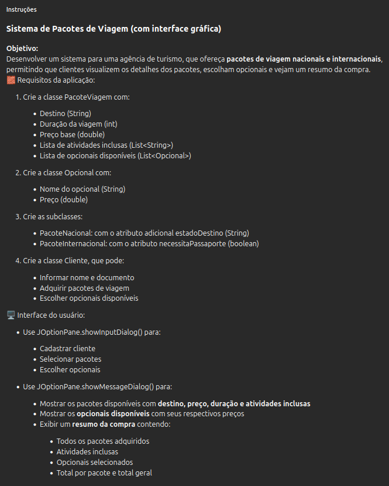
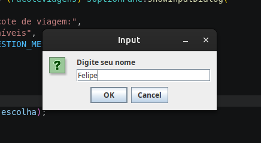
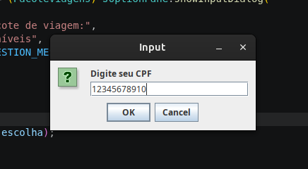
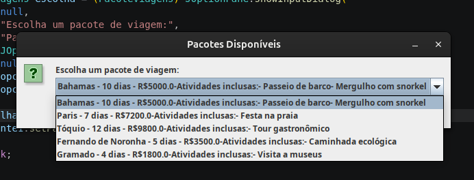
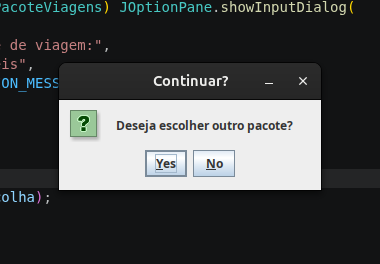
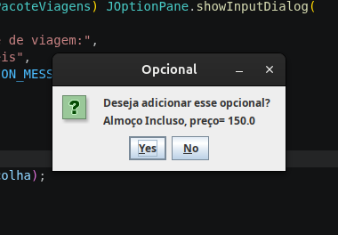
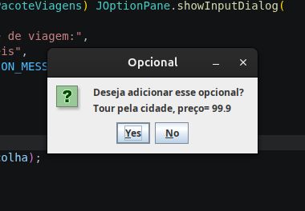
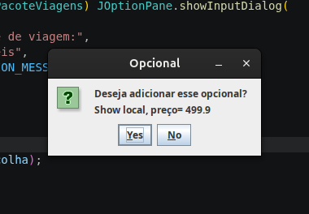
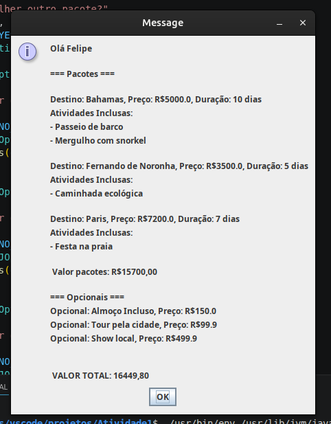

# Sistema de Pacotes de Viagem (Java + JOptionPane)

## Sobre o projeto

Este projeto foi desenvolvido em Java com o objetivo de simular um sistema de uma agência de turismo, permitindo gerenciar pacotes de viagem nacionais e internacionais.

A aplicação possibilita que o usuário visualize pacotes, selecione opcionais e obtenha um resumo completo da compra, aplicando na prática conceitos de Programação Orientada a Objetos (POO) como herança e polimorfismo.

A interface foi construída utilizando JOptionPane, proporcionando uma interação simples e intuitiva, sem necessidade de uso do terminal.

## Funcionalidades
- Cadastro de cliente
- Visualização de pacotes de viagem
- Seleção de pacotes (nacionais e internacionais)
- Escolha de opcionais adicionais
- Exibição de resumo da compra com:

📍 Destinos escolhidos

🗓️ Duração das viagens

🎯 Atividades inclusas

💰 Valores individuais e total geral


## Como executar

1- Clone o repositório
```script 
    git clone https://github.com/FelipeDeLaraKunz/Sistemas-Pacote-Viagens-Java.git
```
2-Abra o projeto em uma IDE Java (ex: IntelliJ, Eclipse, NetBeans)

3-Execute a classe principal "Atividade1.java"

# Prints

## Atividade


## Telas

Tela 1


Tela 2


Tela 3


Tela 4


Tela 5


Tela 6


Tela 7


Tela 8

